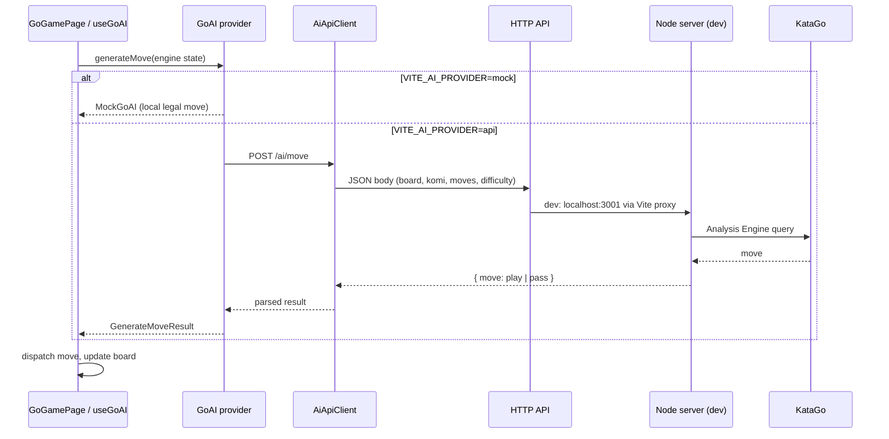

# AI architecture

Let's Play Go separates **game UI and rules** from **where the AI runs**. The React app never embeds API keys or talks to KataGo directly.

## Flow

## Client layers

| Layer | Role |
|-------|------|
| `useGoAI` | Orchestrates turns, aborts stale requests, applies moves |
| `GoAI` (`MockGoAI` / `ApiGoAI`) | Provider boundary — UI does not know about HTTP |
| `AiApiClient` | Single HTTP client for `/ai/move` and `/ai/analyze` |
| `api/config.ts` | Env-based provider + base URL + timeout |
| `api/contracts.ts` | Typed wire format matching `POST /api/ai/move` |

## Configuration

| Variable | Purpose |
|----------|---------|
| `VITE_AI_PROVIDER` | `mock` (default) or `api` |
| `VITE_AI_API_BASE_URL` | HTTPS API origin in production (e.g. `https://api.example.com`). **Required** for Capacitor/iOS builds when using `api`. |
| `VITE_AI_TIMEOUT_MS` | Client timeout (default 30s) |

**Development:** leave `VITE_AI_API_BASE_URL` unset — Vite proxies `/api` → `http://localhost:3001` (local Node + KataGo).

**Production / iOS:** set `VITE_AI_API_BASE_URL` to your remote HTTPS endpoint before `npm run build`. Do not use `localhost`. Do not put secrets in the client; authenticate on the server when you deploy.

## HTTP contract

`POST {baseUrl}/ai/move` — same body/response as the existing Node server (`server/src/validation/aiRequest.ts`).

Errors return JSON `{ error?, message? }` with appropriate status codes (502/503/504). The client maps these to user-facing timeout/unavailable messages.

## Stale request safety

- `createAiRequestCoordinator` prevents overlapping generations in `useGoAI`.
- `AbortController` cancels in-flight HTTP when the user undoes, starts a new game, or leaves the screen.
- Responses from cancelled generations are ignored before applying moves.

## Analysis

Review, coach, and live hints use the same `AiApiClient` against `POST /ai/analyze`, with the same base URL configuration (independent of mock opponent mode).
